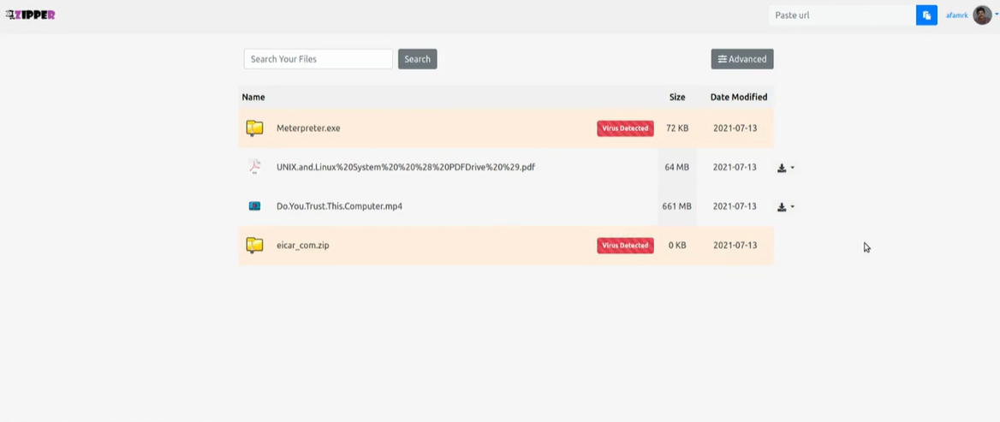

➢ web application that compress any file on the internet

➢ Mainly aims at the people who struggle to meet up their requirements with the
limited data pack especally in these pandamic time.

➢ compress any file before downloading it.

➢ An anti virus system embedded with in the web app provides secure downloading
environment

➢ A feature of split downloading is made available, that allows user to split the files to
their desired sizes.

# SCREEN SHOT

# DEMO

